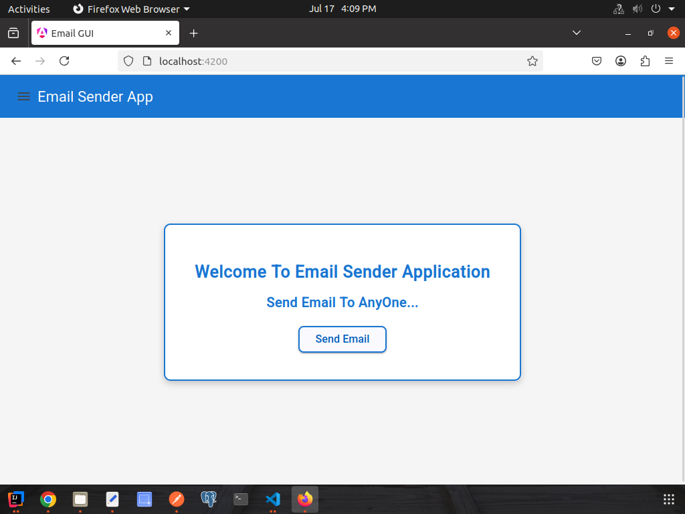
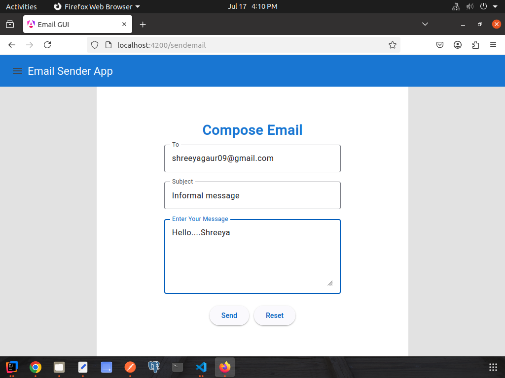
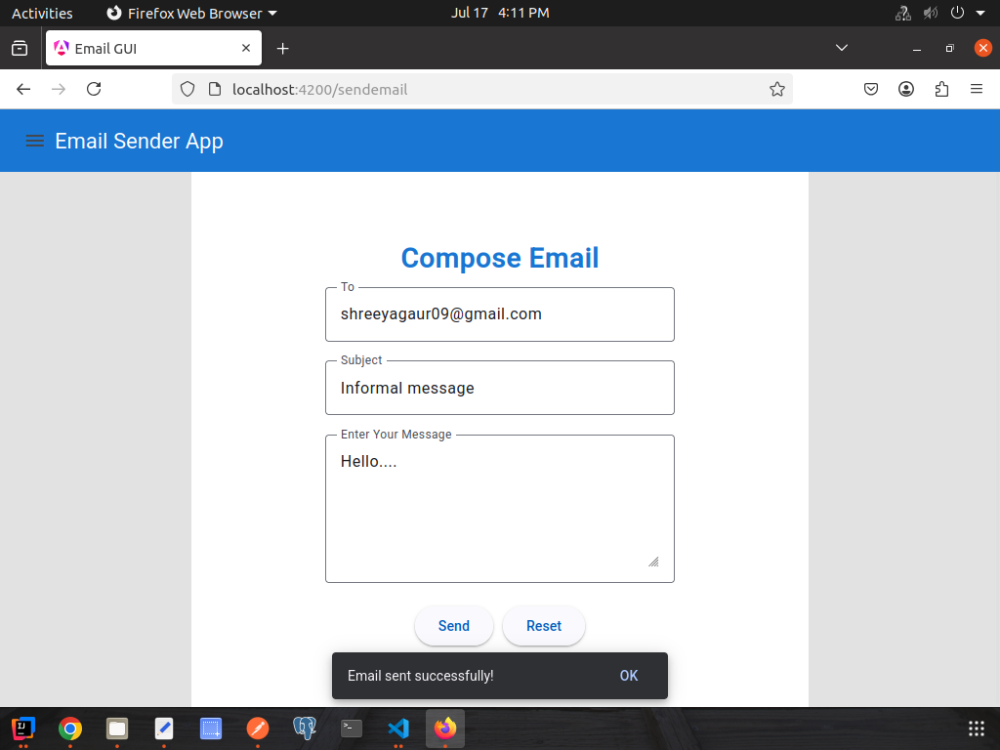

# 📧 Email App Frontend

A responsive frontend application built with **Angular** that allows users to compose and send emails through a Spring Boot REST API.

---

## 🚀 Features

- 📩 Send emails using a simple and intuitive interface
- 🎨 Responsive UI built with Angular
- 🔗 Integration with Spring Boot REST API
- ✅ Form validation
- ⚡ Fast and lightweight application

---

## 🛠️ Technologies Used

- Angular 22
- TypeScript
- HTML5
- CSS3
- Angular Material
- RxJS
- REST API

---

## 📂 Project Structure

```
src/
│
├── app/
│   ├── home/
│   ├── navbar/
│   ├── email/
│   ├── service/
│   ├── app.routes.ts
│   └── app.config.ts
│
├── assets/
└── styles.css
```

---

## ⚙️ Prerequisites

Before running the application, make sure you have installed:

- Node.js
- npm
- Angular CLI

---

## 🚀 Getting Started

### Clone the repository

```bash
git clone https://github.com/Shreeya-gour/email---app---frontend-.git
```

### Navigate to the project

```bash
cd email---app---frontend-
```

### Install dependencies

```bash
npm install
```

### Run the application

```bash
ng serve
```

Open your browser and visit:

```
http://localhost:4200
```

---

## 🔗 Backend Integration

This application communicates with the Spring Boot backend.

Default Backend URL:

```
http://localhost:4300
```

Make sure the backend server is running before using the application.

---

## 📸 Screenshots


### Home Page



### Email Form



### Success Message



---

## 🔮 Future Improvements

- User Authentication
- Email History
- File Attachments
- Rich Text Editor
- Dark Mode
- Email Templates

---

## 👩‍💻 Author

**Shreeya Gour**

GitHub: https://github.com/Shreeya-gour

---

## ⭐ If you like this project

Please consider giving it a ⭐ on GitHub.